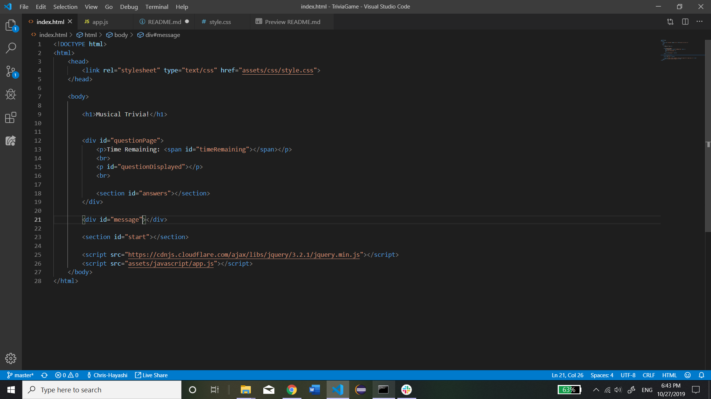
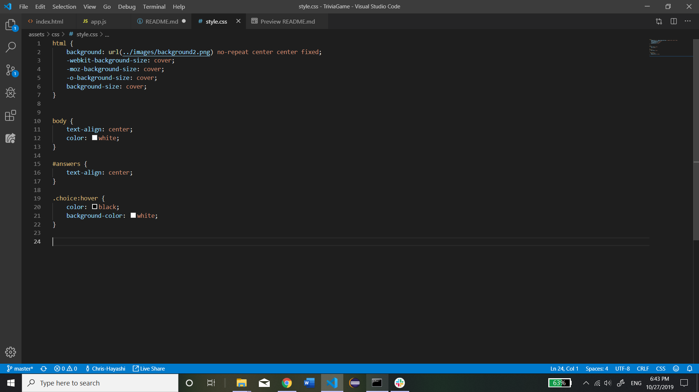
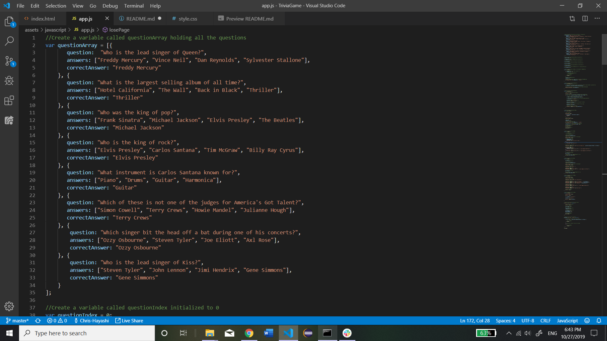
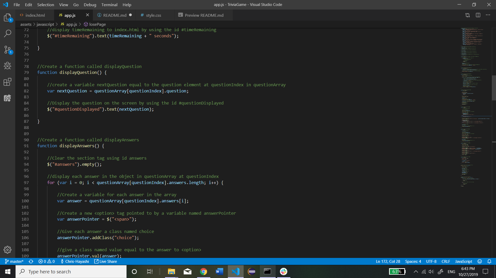
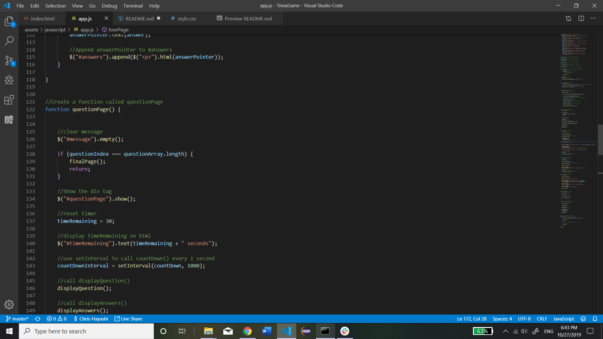
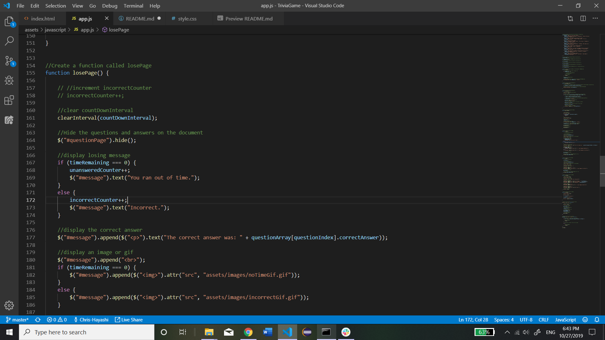
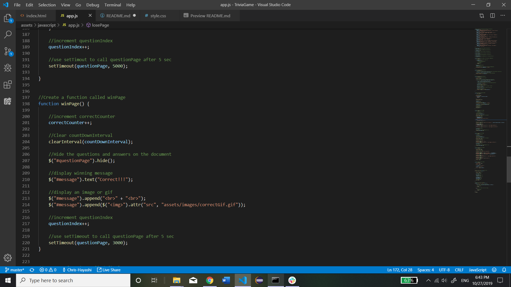
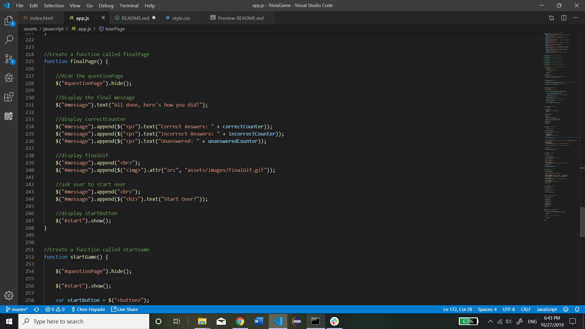
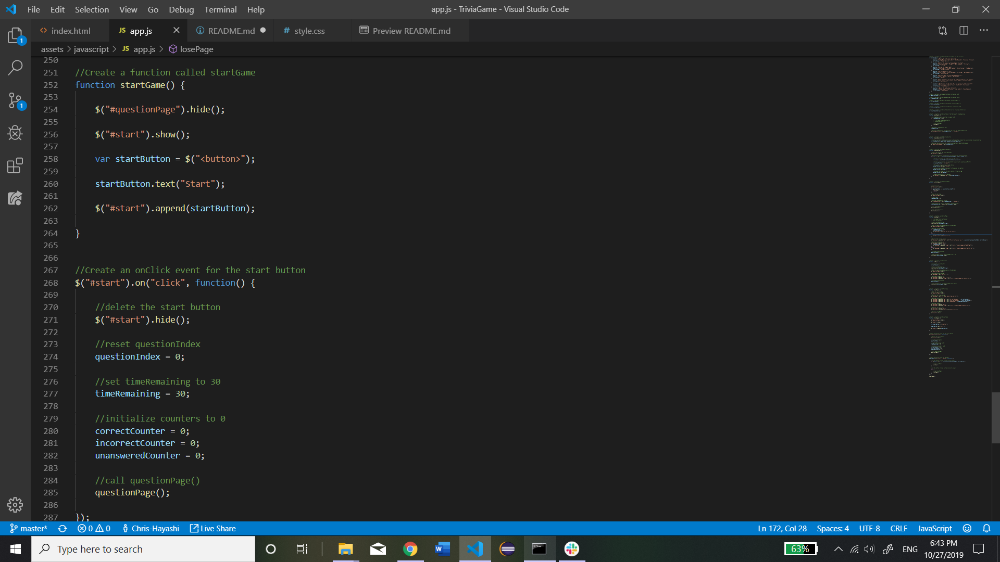
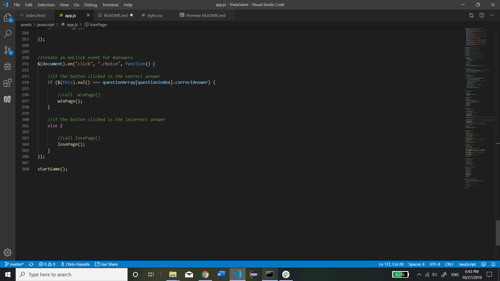

# TriviaGame

The assignment: Create a trivia game that includes multiple choice questions, a timer, counters, and gifs.

Technologies Used: Visual Studio Code, Google Chrome, and Git Bash

Screenshots:

    index.html:
        

    style.css:
        

    app.js:
        
        
        
        
        
        
        
        
        